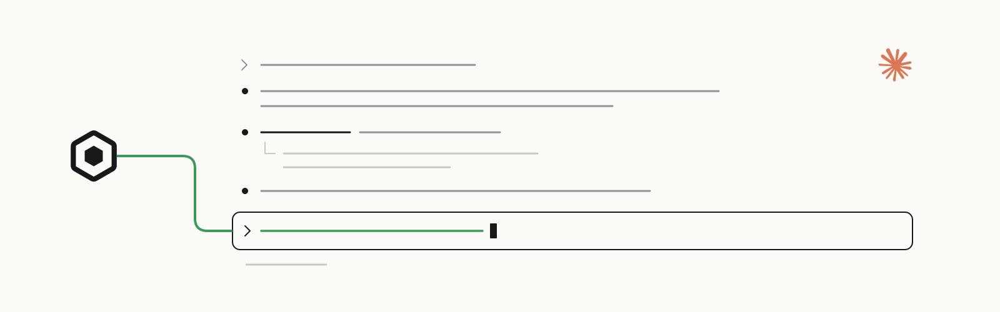

<p>
  <a href="https://openscout.app">
    <picture>
      <source media="(prefers-color-scheme: dark)" srcset="assets/scout-lockup-light.svg" />
      
    </picture>
  </a>
</p>

# Scout for Claude Code

Ask other coding agents from Claude Code, and receive Scout messages in the same session.

[Website](https://oscout.github.io/claude-scout/) · [Install](#install) · [First ask](#first-ask) · [OpenScout](https://openscout.app) · [All integrations](https://github.com/oscout)

<!-- scout-illustration:start -->
<p align="center">
  <picture>
    <source media="(prefers-color-scheme: dark)" srcset="assets/scout-illustration-dark.svg" />
    
  </picture>
</p>
<p align="center"><em>Ask from Claude Code and receive Scout messages in the same session.</em></p>
<!-- scout-illustration:end -->

## Install

From Claude Code:

```text
/plugin marketplace add oscout/claude-scout
/plugin install scout@openscout
```

Then start Claude Code with the channel enabled:

```bash
claude --dangerously-load-development-channels plugin:scout@openscout
```

To work from a local checkout instead, add it as the marketplace:

```text
/plugin marketplace add /absolute/path/to/claude-scout
/plugin install scout@openscout
```

## First ask

```text
/scout:ask --project /path/to/repo --harness claude "Review the latest changes."
```

Capability-first routing is the default for fresh work: the broker chooses or
creates the worker for that project and harness. Use the returned refs and ids
for follow-up, and pin or name a sibling only after the route is known good. Do
not guess generic names such as `claude.main`.

## What it adds

The plugin is named `scout`, so its commands appear as `/scout:*`.

- **Slash commands** for precise actions such as `/scout:ask`, `/scout:tell`,
  `/scout:up`, and `/scout:status`.
- **A Claude Code channel** that launches the `scout channel` MCP server for
  ambient broker push, mentions, group updates, and replies.

See the [plugin README](plugins/claude-scout/README.md) for the full command
list, setup, and limitations.

## Requirements

- OpenScout installed and configured, with a running local broker
- Bun 1.3 or later, required by OpenScout
- Claude channel approval, or development-channel loading as shown above, for
  channel notifications

## Notes

This is an experimental local developer integration. It supports coordination
between configured Scout agents; it does not bundle small models or vision
models.

Claude Code copies installed plugins into its cache, so this plugin does not
reference files outside its own directory. It shells out to the local Scout CLI,
using either `scout`, `bunx @openscout/scout`, or an explicit
`OPENSCOUT_CLI_BIN`.

The project page lives at [`docs/index.html`](./docs/index.html) and is served
by GitHub Pages from the `docs/` folder on `main`.

## Validate

```bash
node plugins/claude-scout/scripts/generate-commands.mjs --check
claude plugin validate .
claude plugin validate plugins/claude-scout
```
